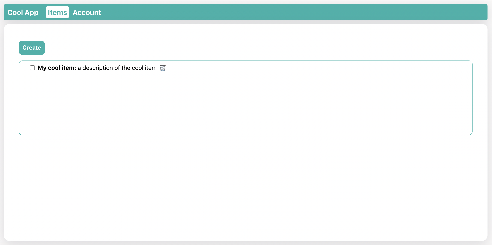
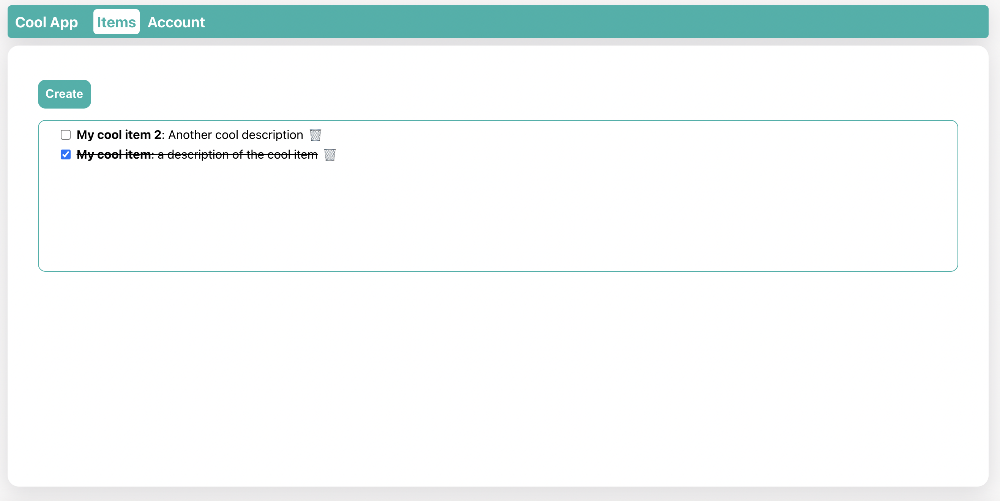

# FastAPI Example UI

This project is an example front end UI for the [fastapi-example-project](https://github.com/jdglaser/fastapi-example-project)

## Running locally

1. Clone project to local folder
2. Run `npm install`
3. Make sure the [backend project](https://github.com/jdglaser/fastapi-example-project) is running
4. Run `npm run dev` and open http://localhost:3001/

## Screenshots

